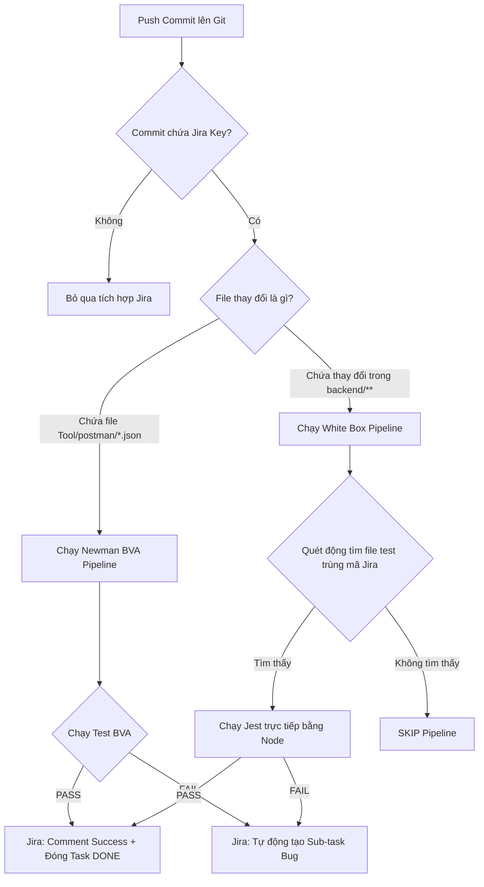

# Hướng Dẫn Quy Trình Kiểm Thử Tự Động (Newman + White Box Testing)

Tài liệu này hướng dẫn chi tiết quy trình, quy tắc đặt tên, cách chạy local và cơ chế hoạt động của hệ thống CI/CD tích hợp Jira cho cả hai luồng: **Kiểm thử API/BVA (Newman)** và **Kiểm thử hộp trắng (White Box - Jest/Supertest)** của dự án StudyHub.

---

## 📂 1. Quy tắc Đặt tên File & Cấu trúc Thư mục

Để hệ thống CI/CD có thể tự động ánh xạ chính xác kết quả kiểm thử lên Jira, cấu trúc và tên file phải tuân thủ nghiêm ngặt quy tắc sau:

### A. Luồng BVA / API Integration (Newman)
*   **Thư mục lưu trữ:** [Tool/postman/collections/](file:///C:/Users/ADMIN/Studyhub-platform---KTPM/Tool/postman/collections)
*   **Đặt tên file:** Đặt tên file `.json` **bằng chính mã ticket Jira** của kịch bản test đó.
    *   *Ví dụ:* `SH-105.json`, `SH-108.json`...
*   **Dynamic Seeding:** Không hardcode các biến ID (như `userId`, `groupId`...). Hãy lưu động biến này ở phần script `Tests` ngay sau khi gọi POST tạo mới resource để truyền qua các request tiếp theo.

### B. Luồng White Box Testing (Jest + Supertest)
*   **Thư mục lưu trữ:** `backend/<service_name>/test/`
*   **Đặt tên file:** Đặt tên file `.test.js` **bằng chính mã ticket Jira** của kịch bản test đó.
    *   *Ví dụ:* `SH-164.test.js`, `SH-166.test.js`...

---

## 🧪 2. Cách chạy Kiểm thử ở máy Local

Trước khi push code lên Git, các thành viên/lập trình viên cần chạy kiểm thử dưới local để tự kiểm tra lỗi:

### A. Chạy BVA/API Test (Newman)
1. Khởi động môi trường Docker backend:
   ```bash
   cd deployment/docker
   docker compose up -d --build
   ```
2. Chạy kịch bản test:
   * **Cách 1 (Chạy tất cả):** Chạy script tự động quét và chạy toàn bộ collections của User Service:
     ```bash
     node Tool/scripts/run_all_user_service_tests.js
     ```
   * **Cách 2 (Chạy lẻ):** Chạy lẻ một file Postman:
     ```bash
     newman run "Tool/postman/collections/User_Service/SH-105.json" --env-var "gatewayUrl=http://localhost:8000/api/v1"
     ```

### B. Chạy White Box Test (Jest)
1. Truy cập vào thư mục của service cần test:
   ```bash
   cd backend/user_service
   ```
2. Cài đặt các gói dependencies (nếu chưa cài):
   ```bash
   npm install
   ```
3. Thực thi kiểm thử:
   * **Chạy tất cả:** `npm test`
   * **Chạy lẻ một file test để sửa bug:**
     ```bash
     node --experimental-vm-modules node_modules/jest/bin/jest.js test/SH-164.test.js
     ```
   * **Xem báo cáo trực quan (HTML Coverage):** Sau khi chạy test xong, sếp và dev có thể mở file báo cáo chi tiết độ bao phủ bằng trình duyệt tại:
     `backend/user_service/coverage/lcov-report/index.html`

### 💡 C. Quy tắc Mocking cho ES Modules (Quan trọng cho Dev)
Do dự án sử dụng **ES Modules (ESM)** thay vì CommonJS, các module import là dạng liên kết chỉ đọc (read-only bindings). Khi viết Unit Test và cần mock một thư viện hoặc một repository/helper, các dev phải tuân thủ cấu trúc sau:
1. Sử dụng `jest.unstable_mockModule` **trước khi** import bất kỳ module nào khác.
2. Dùng hàm `await import()` động để load module cần test.
*Ví dụ mẫu:*
```javascript
import { jest } from '@jest/globals';

// 1. Mock module/file helper trước
jest.unstable_mockModule('../src/utils/jwt.js', () => ({
  verifyAccessToken: jest.fn()
}));

// 2. Load động bằng await import
const jwtUtils = await import('../src/utils/jwt.js');
const { verifyAccessToken } = await import('../src/middlewares/auth.js');
```

> [!NOTE]
> Các file báo cáo tự động sinh ra khi chạy local như thư mục `coverage/` hay file `jest-report.json` **không được commit lên Git**. Hãy chắc chắn các file này đã được liệt kê trong file `.gitignore` của service.

---

## 🚀 3. Quy trình Git & Cơ chế Tự động hóa CI/CD + Jira

Quy trình hoạt động trên nhánh tính năng và cơ chế hoạt động của GitHub Actions:

### ⚠️ Quy tắc commit bắt buộc:
*   Mỗi commit chỉ được đẩy lên **DUY NHẤT một tệp kiểm thử** tương ứng với mã Jira. **Không gộp chung nhiều file test vào cùng một commit**.
*   Commit message phải viết bằng **tiếng Việt không dấu, viết hoa chữ cái đầu tiên** và bắt đầu bằng mã Jira ticket:
    *   *Ví dụ:* `SH-164: Trien khai Unit Test cho ProfileService`
*   Việc commit lẻ giúp CI/CD bóc tách đúng mã ticket từ commit message để ánh xạ lên Jira chuẩn xác.

---

### 🔄 Cơ chế hoạt động của Luồng CI/CD:



#### 1. Luồng Newman (BVA) - file `newman-jira.yml`
*   **Trigger:** Khi commit chứa thay đổi ở thư mục `Tool/postman/**`.
*   **Hoạt động:** Newman tự động khởi động các containers Docker, chạy file test `.json` tương ứng với Jira key của commit.
*   **Nếu không có file `.json` nào đổi:** Trạng thái gán là `NEWMAN_STATUS=SKIP` để bỏ qua các bước comment Jira, tránh phát sinh lỗi Bad Request.

#### 2. Luồng White Box (Jest) - file `whitebox-test.yml`
*   **Trigger:** Khi commit chứa thay đổi ở thư mục `backend/**`.
*   **Hoạt động:** Hệ thống tự động quét tìm tệp `SH-xxx.test.js` trong thư mục `test/` của các service. Khi tìm thấy, nó sẽ tự động chui vào service đó và thực thi chạy độc lập bằng Jest trực tiếp.
*   **Đồng bộ Jira:** 
    *   **PASS:** Tự động bình luận báo cáo chi tiết độ bao phủ (coverage) và chuyển trạng thái ticket sang **DONE**.
    *   **FAIL:** Tự động tạo một **Sub-task Bug** gắn với ticket chính để báo lỗi cho Dev.
